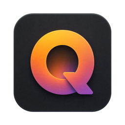

# QLens



> **QLens is a lightweight image viewer + tag manager designed for the AI era.**

English · [中文](README.md)

QLens is built around an open image-tagging protocol (`qltag.db`) that any
software, script, or AGENT can read and write:

| Component | Description |
|---|---|
| **QLens QuickView** | Native Win32 + D3D11 ultra-fast viewer — instant start, **HDR rendering**, WIC full-format + decoder plugins |
| **QLens Manager** | Qt file-manager style — thumbnail browsing, **tag management** (assign/color/combo filter), **QC inspection** (auto-detect overexposure/blur/color-cast) |
| **QLens MCP Server** | Opens your image library to AI clients (Claude / Cursor, etc.) — search/tag/statistics/batch analysis |

## Quick Start

```
bin/qlens_quickview.exe  double-click or drag an image to view (F=100%, S=fit window, wheel=paging)
bin/qlens_manager.exe    browse folders, tag images, run QC detection (double-click image to view)
```

**System requirements**: Windows 10 1809+ (HDR features need an HDR display; HEIC/AVIF etc. need WIC extension or decoder plugin).

## Documentation

- [Overview](docs/en/01-overview.md) — design philosophy & the three components
- [QuickView Manual](docs/en/02-quickview.md) — shortcuts / HDR / plugins
- [Manager Manual](docs/en/03-manager.md) — file management / tags / QC / batch
- [Tag Protocol Spec](docs/en/QLENS_TAG_PROTOCOL.md) — `qltag.db` schema & classification ★
- [MCP Server](docs/en/05-mcp.md) — tools / setup / examples
- [Plugin Development](docs/en/06-plugin-dev.md) — decoder plugin API
- [Build & Release](docs/en/07-build.md) — dependencies / build / system requirements

## License

[LICENSE](LICENSE)
